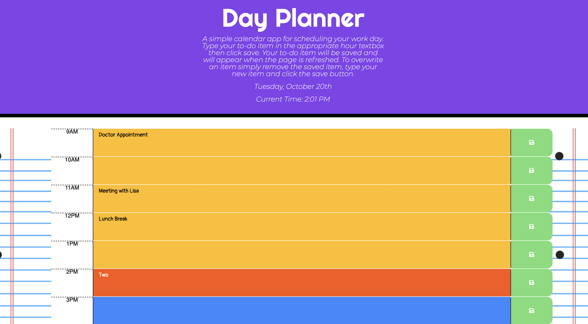

# day-planner
An application that can be used to help organize your day. 

The text entered in each hour's text area will be saved to local storage. Time slots that have are in the past are represented with a different color from time slots in the present and future.

The saved information will be rendered on the refresh of the page.

# Screenshots of Application

# Deployment

[link to deployment](https://ivybean.github.io/day-planner/)